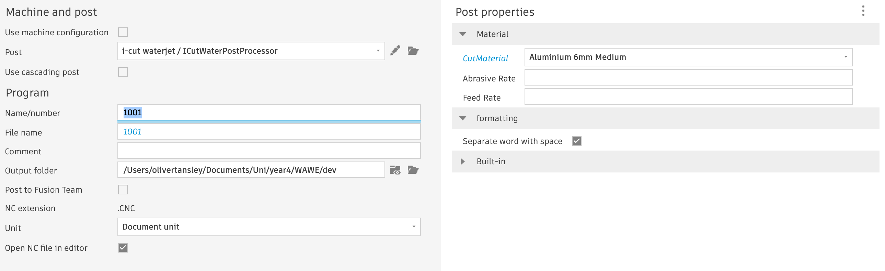

# ICutWater Post Processor

## Installation

This post processor is designed for the ['icutWater Eco 2' waterjet.](https://emco.co.uk/icutwater-eco-series-water-jet-machine/), and can be installed directly into fusion360 by importing it into the [post library](https://www.autodesk.com/support/technical/article/caas/sfdcarticles/sfdcarticles/How-to-add-a-Post-Processor-to-your-Personal-Posts-in-Fusion-360.html).

## Usage

\* **POST OPERATES IN ABSOLUTE COORDINATES** \*
This means once the cutting position is selected you **MUST** set this as the new home reference point which is found in kr8 drives menu labelled 'set 0 position' make sure this stays ticked.

The post processor offers two unique options for ensuring the correct gcode is generated depending on desired functionality and cutting material.

The three options are selected under post properties when using the post in fusion and are as follows:

- CutMaterial: determines what feed rate and abrasive flow rate to output dependant on material choice.
- Pause between profiles: when enabled will insert pause commands to wait for user input (ENTER key) between cut profiles to allow them to be removed.
- Separate word with space: when enabled will put spaces between codes and code arguments in the .CNC file (doesn't impact resulting cuts)



## Maintainance and modifications

### Executing nc output correctly

The nc output you wish to execute on the icutWater Eco 2 must conform to the following:

- file extension must be '.CNC'.
- file must pass the waterjets 'parsing' stage.

### nc output parsing (specific to iCutWater jet)

Before .cnc files can be executed on the icutWater Eco 2, the .cnc file is read in its entirety to test the formatting is as expected, the following rules are applied to the gcode beyond typical expectations of correctness:

- All arc commands must provide an X Y I and J argument even if the argument passed is 0.
- The following parameters must be set in this order: Feed rate (eg F321), abrasive flow rate (eg M200 1.5), acceleration (eg G131 10), kerf width (eg S0.9), and finally coordinate preference (either G90 or G91, this post uses G90)
- M02 must terminate the file as it is the 'end program' commands
- All G commands should be proceeded with two digits e.g. G01 G90 G03. Other than G0

Beyond these points traditional formatting constraints should be adhered to such as single instructions per line, comments prefixed with ';' etc.

## Code Organisation and descriptions

### Write block

```javascript
function writeBlock()
```

Write block function formats any arguments passed to it and writes it onto one line of the .cnc output file. As well as writing line numbers provided that option is enabled in the post processor options in fusion.

### on Open

```javascript
function onOpen()
```

onOpen initially sets required parameters before the process of writing gcode begins.

A case statement is used to select material and abrasive feed rates.

```javascript
switch (getProperty("cutMaterial")) {
    case "1": // alu 8mm goood
      matFeed = "70";
      abrFeed = "1.5";
      break;
...
```

However, if values for these parameters are provided in the post processor menu in fusion, these will overwrite the values set by the case statement (they take precedence over the material selected).

```javascript
if (getProperty("overwriteAbrasiveRate")) {
  writeBlock("M200", getProperty("overwriteAbrasiveRate"));
} else {
  writeBlock("M200", abrFeed);
}
if (getProperty("overwriteFeedRate")) {
  writeBlock("F" + getProperty("overwriteFeedRate"));
} else {
  writeBlock("F" + matFeed);
}
```

The acceleration is also inserted as well as 'S0.9' and 'G90' to set the kerf width and coordinate system respectively.

### onDwell

```javascript
function onDwell(seconds)
```

Outputs a dwell statement to the cnc output file ensuring the dwell time is a suitable length.

### onRadiusCompensation

```javascript
function onRadiusCompensation()
```

Reassigns the pendingRadius variable such that the appropriate Gcode command is written before the next linear movement when the next `onLinear()` call is made.

### onParameter

```javascript
function onParameter(name,value)
```

This function executes different code blocks based on the name and value of the parameter passed, the only one required for this water-jet being to run an initial peirce before running the lead in movements.

### onPower

```javascript
function onPower(enable)
```

Toggles the water and abrasive feed of the water-jet, if the pause delimited option is enabled then a pause command can be inserted between each activation and deactivation of these outputs.

### onRapid

```javascript
function onRapid(_x, _y, _z)
```

Writes the appropriate G0 command to execute a fast movement where the cut will not be active. Throws an error if there is a pendingRadiusCompensation as this is not possible in rapid movements.

### onLinear

```javascript
function onLinear(_x, _y, _z, feed)
```

Adds the appropriate G01 command to execute linear cut movements. Different G4X commands are added before the G01 to ensure the correct radius compensation is added to the next movement. The feed variable is ignored in this post processor as the feed is only set in the initial setup phase of this post processor (inside the `onOpen()` function).

### onCircular

```javascript
function onLinear(clockwise, cx, cy, cz, x, y, z, feed)
```

Adds the appropriate G02 or G03 commands for arc cuts based on the value of the `clockwise` parameter which is a boolean value.

If a `pendingRadiusCompensation` is applied an error is thrown as this is not available on clockwise movements.

### onCommand

```javascript
function onCommand(command)
```

Outputs the appropriate Gcode command for a given enum passed as `command`, including: COMMAND_STOP,COMAND_OPTIONAL_STOP,COMMAND_END.

### onSectionEnd

```javascript
function onSectionEnd();
```

Toggles power off at the end of every section of cutting movements.

### onClose

```javascript
function onClose();
```

Outputs a terminate program command 'M02' at the end of the .cnc output.
